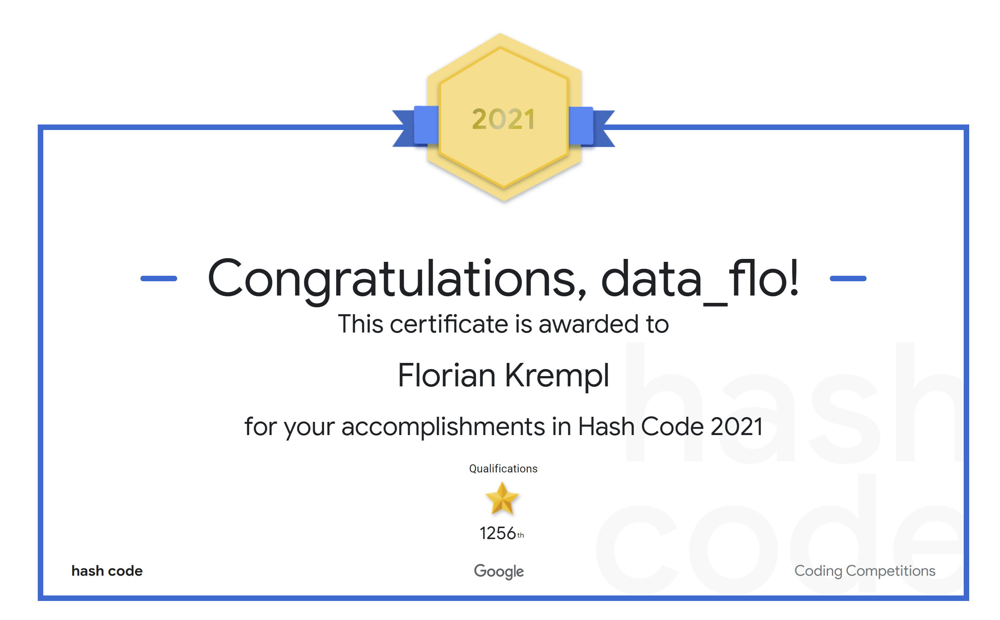
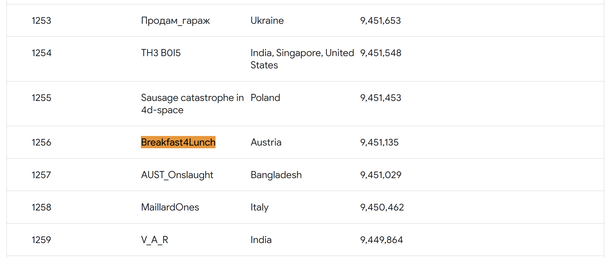

# Google Hashcode Online Qualification

Hash Code is a yearly team programming competition, organized by Google, for students and professionals around the world. 
The problems are always engineering related and you need optimization methods to solve them. 

The structure in this repo is chaotic on purpose. 
Due to the time limit in the competition our team focuses on rapid prototyping and fast code iteration.
We try to solve the problem in the most simple way possible and then iterate and improve the solution in the time we have left. 

# Problem Statements

## 2020 

The Books and Library Problem 

Given a description of libraries and books available, plan which books to scan from
which library to maximize the total score of all scanned books, taking into account that
each library needs to be signed up before it can ship books.

## 2021 

The Crossroads Problem 

Given the description of a city plan and planned paths for all cars in that city,
optimize the schedule of trac lights to minimize the total amount of time spent in
trac, and help as many cars as possible reach their destination before a given
deadline.

# Results 

More than 125,000 students and professionals from around the world registered for Hash Code 2021.
We got placed top 10 in Austria.

  

  

